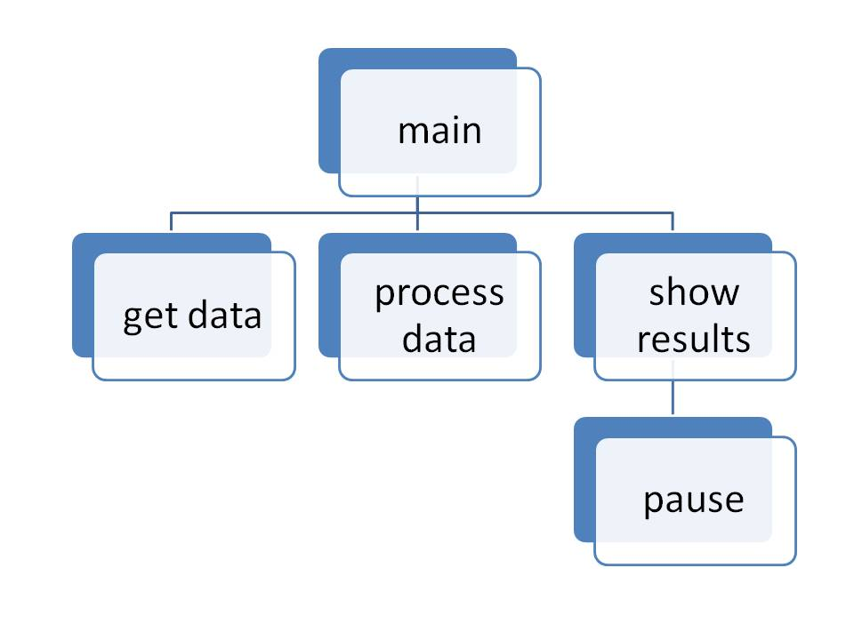

# Hierarchy Charts

The structure chart \(also known as a hierarchy chart\) is a view that shows the relationship of modules in your program. The structure chart arranges your program modules into a tree. Each module is represented by a box. Inside each box is the name of the module. Further details are left out of this view.

Structure charts help you to divide a large software problem into parts small enough to be easily understood.

Its name comes from its general use in showing the organization \(or structure\) of a business. The CEO is at the top, followed by the president then the vice presidents, etc on lower levels.

