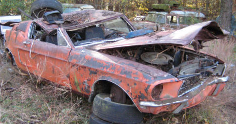
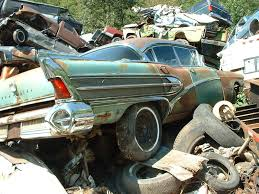
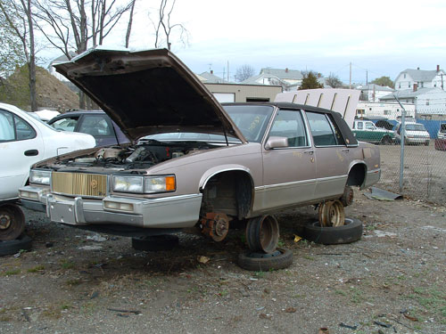

# Show Me the Images

Your web page needs images.That's easy. We were out in the yard earlier today and took some pictures. They're below. You can right-click on them and save them to your web project. Put them in a folder called images under the Web Content folder.

The image tag has three attributes:

* **src** - the path and filename of the image. Most images are .jpg or .png or .gif
* **alt** - the text that displays when you hover over the image or if the image fails to load
* **style** - allows you to set height, width, border and more

```markup

```

Add a header image to your page: 

Add some of our favorite old cars as well....

A mustang.. needs work 

This was the coolest car at the drive in



Not your father's Oldsmobile 

The unfortunate Yougo


