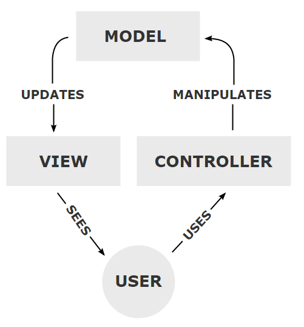

# Servlets and Enterprise Application Development

This course is about developing web applications. We are using Java technologies. The Java Enterprise Edition \(Java EE\) specification is your guide. It describes how web servers and Java web technologies work together.

The technologies we use in this course include:

* Servlets
* Plain Old Java Objects \(POJO\)
* JavaServer Pages \(JSP\)
* Java Persistence API \(JPA\) and Java Persistence Query Langauge \(JPQL\)
* Enterprise JavaBeans \(EJB\)
* Oracle Database
* HTML, CSS and JavaScript
* Tomcat Web Server

In your web applications you will be creating servlets and JavaServer Pages \(JSP\). Your applications will be following the Model 2 \(MVC\) pattern. This means the site consists of a Model, View and Controller. The Model is the database and any supporting classes. The view is the html or JSP code. The view is displayed in the user's browser. The controller is the servlet and other Java classes which control the business logic. The controller handles the communication between the model and the view.

The role of servlets is to perform server-side processing. They are an extension of the web application server. We use Apache Tomcat because it is a servlet/JSP engine which includes a web server. The JSPs store the HTML. They present the user interface through the browser. The JSPs may contain Expression Language tags. The servlet can use the tags to populate the JSP with data. Often the data comes from a database. We will be using Oracle.

