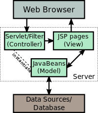

# JavaServer Pages \(JSP\)

JavaServer Pages \(JSP\) is the technology you use to create dynamically generated web pages. JSP builds on HTML and XML. JSP is like PHP but uses Java and customized tags. In both you combine code and html tags to make dynamic web pages.

To deploy and run JavaServer Pages, use a compatible web server with a servlet container. These include Apache Tomcat or Oracle GlassFish Application Server. The servlet container creates JSP objects that you can use to pass data between pages and servlets. These objects include the pagecontext, the session, request & response.

## A JSP becomes a servlet

A JSP may be viewed as an abstraction of a Java servlet. JSPs are translated into servlets at runtime. Each JSP servlet is cached and re-used unless the original JSP is modified.

Java Server Pages can be used independently. They are often used as the view component of a web application following the model–view–controller design. Java servlets act as the controller. The database and related classes \(JavaBeans\) act as the Model.

**What is a JavaBean?** A JavaBean is a Java class which meets three requirements.It has a no-argument constructor. All instance variables are private. And it includes get and set methods for all properties that you want to allow the user to access.

**Model-view-controller paradigm**  
A model-view-controller pattern separates the presentation from request processing and data storage. Either servlets or JSP files are used to process the request. After the request processing has finished, control is passed to a JSP only for creating the output.

