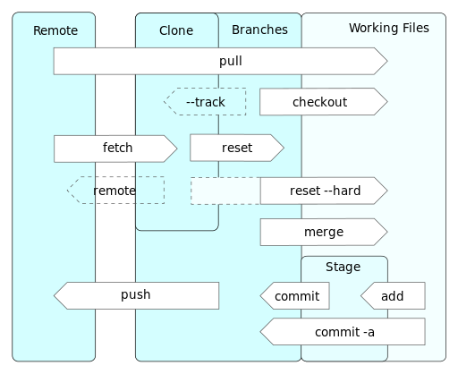

# Git Overview

By Daniel Kinzler \(Own work\) \[[GFDL](http://www.gnu.org/copyleft/fdl.html) or [CC BY 3.0](http://creativecommons.org/licenses/by/3.0)\], [via Wikimedia Commons](https://commons.wikimedia.org/wiki/File%3AGit_operations.svg)

## Object Types

A Git repository is made up of these object types:

* A ''blob'' holds the entire contents of a single file. It doesn’t hold any information about the name of the file or any other metadata, just the contents.
* A ''tree'' represents the state of a directory tree. It contains the pathnames of all the component files and their modes, along with the IDs of the blobs holding their contents. Note that there is no representation for a directory on its own, so a Git repository cannot record the fact that subdirectories were created or deleted, only the files in them.
* A ''commit'' points to a tree representing the state of the source tree as of immediately after that commit. It also records the date/time of the commit, the author/committer information, and pointers to any parent\(s\) of that commit, representing the immediately-prior state of the source tree.
* A ''tag'' is a name pointing to a commit. These are useful, for example, to mark release milestones. Tags can optionally be digitally signed, to guarantee the authenticity of the commit.
* A ''branch'' is a name pointing to a commit. The difference between a branch and a tag is that, when a branch is the currently-checked-out branch, then adding a new commit will automatically update the branch pointer to point to the new commit.

Blobs, trees and commits all have IDs which are computed from SHA-1 hashes of their contents. These IDs allow different Git processes on different machines to tell whether they have identical copies of things, without having to transfer their entire contents over. Because SHA-1 is a cryptographically strong hash algorithm, it is practically impossible to make a change to the contents of any of these objects without changing its ID. Git doesn’t prevent you from rewriting history, but you cannot hide the fact that you have done so.

A commit may have 0 more parents. Typically there is only one commit with no parents—a ''root commit''—and that is the first commit to the repository. A commit which makes some change to one branch will have a single parent, the previous commit on that branch. A commit which is a merge from two or more branches will have two or more parent commits.

Note that a branch points to a ''single'' commit; the chain of commits is implicit in the parent\(s\) of that commit, and their parents, and so on.

